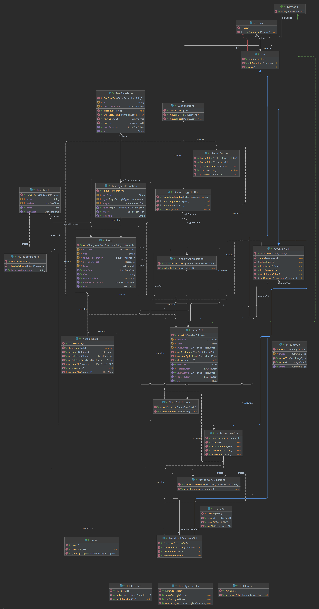

# Notizen-App
Diese Anwendung stellt eine Ansammlung an Notizbüchern dar, in denen man Notizen erstellen, bearbeiten 
und löschen kann.\
\
Die Notizen werden mittels einer bestimmten Dateistruktur gespeichert. Dabei werden die Dateien, 
die den Text der Notizen beinhalten von den Dateien, die die Textformatierungen und den eingefügten Bildern getrennt 
gespeichert.\
Man kann die Schriftart für jede Notiz individuell auswählen. Außerdem hat man die Möglichkeit Bilder an der Stelle, 
an der sich der Cursor befindet, einzufügen.\
Den Text kann man **fett**, *kursiv* oder <ins>unterstrichen</ins> darstellen und kann bei der Schriftgröße von h1-h6
wählen.\
Wenn Bilder eingefügt werden, kann man die Größe dieser Bilder selbst bestimmen. Das Bild wird dann auf die entsprechende
Größe zugeschnitten, eingefügt und als Kopie im Resources-Ordner des Notizbuchs gespeichert.

## Eingebundene Bibliotheken
> ### Lombok 
> Diese Bibliothek implementiert einen eigenen Annotation-Prozessor, wodurch beim Kompilieren der Anwendung für Felder mit
> der Annotation ```@Getter``` oder ```@Setter``` automatisch Getter oder Setter generiert werden. Genauso wird automatisch
> ein Konstruktor für eine Klasse erstellt, die die Annotation ```@RequiredArgsConstructor``` besitzt und jeder Block 
> einer Methode, die mit ```@SneakyThrows``` annotiert ist, wird in einen Try-Catch-Block eingebettet.

> ### Jetbrains-Annotations
> Diese Bibliothek implementiert einige Anmerkungen, die den Code konsistenter machen und logik-Fehlern vorbeugen.\
> In dieser Anwendung wurden ausschließlich die Annotations ```@NotNull```,  ```@Nullable``` und ```@Range``` benutzt. 
> Die ersten beiden Annotations dienen nur der Definition, ob ein Objekt den Wert ```null``` annehmen darf, oder nicht.
> Und die Annotation ```@Range``` dient dazu einen Zahlenwert einzugrenzen.

> ### IText-Core
> Diese Bibliothek bietet eine Schnittstelle, um in Java PDF-Dokumente zu erstellen, indem ein PDF-Writer angeboten wird,
> wie der in der Java-Bibliothek mitgelieferte FileWriter.

# Projektstruktur
